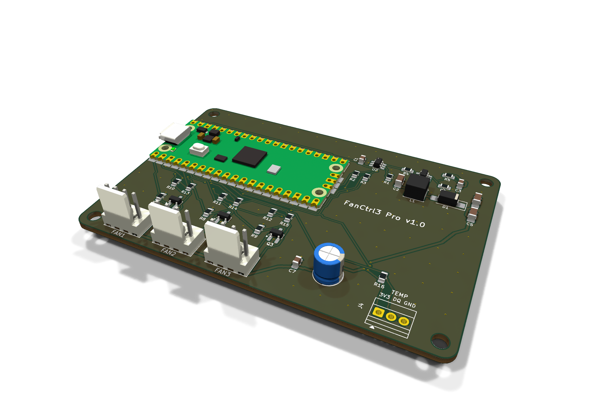
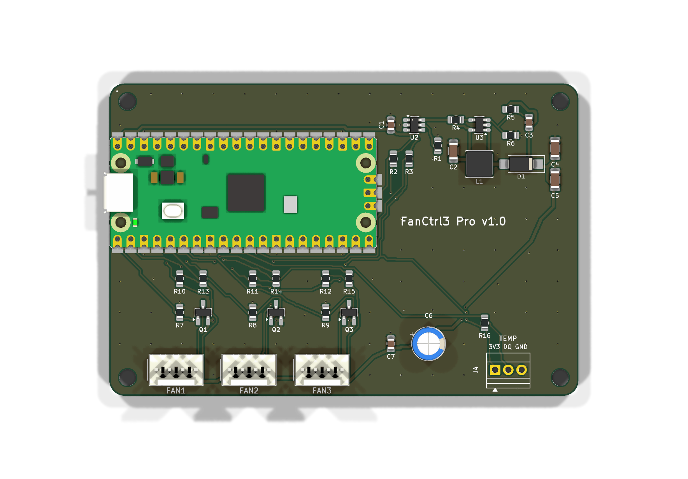
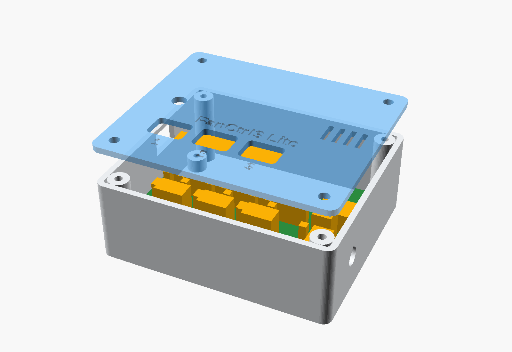
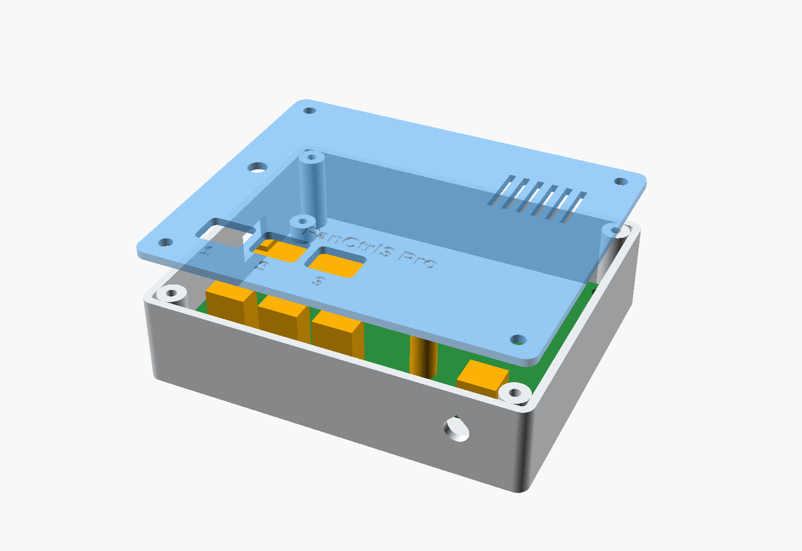

<p align="center">
  
</p>

## FanCtrl3

**A USB-powered controller for three 4-pin PWM fans, driven by the CPU temperature
of a Proxmox VE host.**

One USB cable to the host is all it needs — power, control and fan speed readings
all go over it. The fan curve runs **inside the controller**, so a host reboot, a
crashed service or a pulled cable never leaves the fans stopped.

[](LICENSE)
[](https://www.kicad.org/)
[](https://micropython.org/)
[](#project-status)

<a href="https://github.com/sponsors/mikagosz"></a>

Designed for small home servers and mini PCs running Proxmox: the machine sits in a
closed cabinet, its own fan is not enough for the cabinet, and a set of quiet 120 mm
fans should spin up only when the server actually works.

> [!NOTE]
> FanCtrl3 is a hobby project, built in spare time. Updates may not come often —
> but ideas, questions and build reports are always welcome (see
> [Contact and contributions](#contact-and-contributions)).

---

## Project status

> [!WARNING]
> **FanCtrl3 has not been tested on real hardware yet.** Hardware testing is coming
> soon; this section will be updated with the results. Until the first boards have
> run for a while, treat this as a reviewed design, not a proven product.

### Verified without hardware

| Area | How | Result |
|---|---|---|
| Schematics | KiCad ERC, both variants | 0 errors, 0 warnings |
| Pro PCB | KiCad DRC with schematic parity | 0 violations, 0 unconnected pads, 0 parity issues |
| Lite perfboard | the generator's own checker | every net connected, no hole shared by two nets, no wire through a foreign pad, no overlapping parts |
| Enclosure | intersection of the enclosure with the component bodies | 0 collisions, both variants |
| Control logic | 21 unit tests, run under CPython **and** MicroPython | all pass |
| Firmware `main.py` | runs under the MicroPython unix port on stubbed hardware: replies, 25 kHz inverted PWM, watchdog; `SERVICE` and service mode; `SAVE` success and failure (12 checks) | all pass |
| Host daemon and CLI | 13 end-to-end tests against a simulated controller: sensor selection, curve, `status`, `send`, `calibrate` (incl. a dead fan and failsafe), clean stop, restart without a temperature, crash → failsafe | all pass |

### Not tested yet

- Anything on a real board: soldering, the 12 V rail, the current limiter and its
  `FAULT` signal, real fan speeds from the tachometers, the DS18B20 probe, the LED,
  the watchdog, USB behaviour with and without a host.
- Power drawn from a real USB port with three fans at 100 %.
- The udev rule on a real Pico (`2e8a:0005` is MicroPython's default ID).
- Printing and fitting the enclosure; the Lite mounting-hole positions.

### Known issues

- `fanctl send` prints `None` when the controller does not reply, and without a
  daemon a missing device ends in a Python traceback instead of a short message.
- On hosts with more than one CPU package only the first `coretemp` device is read.
- The firmware comment on the LED patterns does not match the code;
  [docs/firmware.md](docs/firmware.md#status-led) describes the real behaviour.
- `tests/test_main_smoke.sh` depends on timing and can fail on a heavily loaded
  machine; run it again before looking for a bug.

## Features

- **Three 4-pin PWM fans**, 25 kHz PWM and tachometer reading on every channel.
- **Powered from USB only.** An on-board step-up makes the 12 V for the fans; a
  TI TPS2553 current-limited switch limits the fan side to 465–570 mA — the
  budget of a USB 2.0 port — and reports an overload to the controller.
- **Curve in the controller, temperature from the host.** A small daemon on the
  Proxmox host sends the CPU package temperature every 5 seconds; the controller
  applies a curve with hysteresis and ramping.
- **Safe by default.** No temperature for 30 s → fans at 100 %. A dead
  microcontroller → the output transistors switch off → fans at 100 %. A clean host
  shutdown → fans rest at 20 % instead of alarming.
- **Ambient probe.** A DS18B20 on a cable measures the air in the cabinet and raises
  the fans on its own above 40 °C (60 %) and 45 °C (100 %).
- **Stall detection** per fan, per-fan minimum duty and a `calibrate` command that
  measures it.
- **Two variants, one firmware** — see below.
- **Host side needs nothing but Python 3's standard library**, a udev rule and a
  systemd unit.

## Two variants

| | **FanCtrl3 Lite** | **FanCtrl3 Pro** |
|---|---|---|
| Build | modules on a 72 × 47 mm perfboard (SCI PC-3) | custom 2-layer PCB, 90 × 60 mm |
| Soldering | through-hole only (plus one SOT-23-6 on an adapter) | 0805/1206 and SOT-23 by hand, no QFN |
| 12 V | Pololu U3V16F12 module | TI LM27313 boost on the board (12.4 V) |
| PWM output | BC547B, open collector | 2N7002, open drain |
| Current limit | TPS2553 on a SparkFun SOT-23 → DIP adapter | TPS2553 on the board |
| Pico | in sockets, removable | soldered flat |
| Build guide | [docs/build-lite.md](docs/build-lite.md) | [docs/build-pro.md](docs/build-pro.md) |

Both use the same pinout and run the same firmware.

<table>
  <tr>
    <td align="center"><br><sub>Lite — perfboard wiring drawing</sub></td>
    <td align="center"><br><sub>Pro — PCB, top</sub></td>
  </tr>
  <tr>
    <td align="center"><br><sub>Lite — enclosure</sub></td>
    <td align="center"><br><sub>Pro — enclosure</sub></td>
  </tr>
</table>

## How it works

```
 Proxmox host                                 FanCtrl3
┌────────────────────────┐   USB cable    ┌──────────────────────────────────────┐
│ coretemp ─► fanctl     │  power + data  │ Pico: curve, hysteresis, failsafe    │
│             daemon ────┼───────────────►│  ├─ PWM ×3 ──► open collector/drain  │
│  TEMP 54.0 every 5 s   │◄───────────────│  ├─ tach ×3 ◄── fans                 │
│  STATUS, alarms        │                │  └─ DS18B20 ◄── ambient probe        │
└────────────────────────┘                │                                      │
                                          │ VBUS ─► TPS2553 ─► 12V boost ─► fans │
                                          │         (≈0.5 A)                     │
                                          └──────────────────────────────────────┘
```

The link is plain text over USB CDC — `TEMP 54.0`, `STATUS`, `SET 1 40` — so it can
be driven by hand from any terminal. Full protocol: [docs/firmware.md](docs/firmware.md).

## Power budget

The whole controller lives on one USB 2.0 port, which is allowed to supply
**500 mA**. The design is sized for three low-power 120 mm PWM fans rated at up
to **0.6 W each** (for example Noctua NF-P12 redux-1300 PWM):

3 × 0.6 W = 1.8 W at 12 V → ÷ 0.85 converter efficiency + ≈ 0.15 W for the Pico
≈ **0.45 A from the port**.

> [!CAUTION]
> Fans rated above 0.6 W each will not fit this budget. The TPS2553 limits the fan
> side to 465–570 mA and reports `FAULT`, but the fans will not reach full speed.
> Check the rated **input power** of your fans before you build.

## Getting started

1. **Pick a variant** and order the parts — [docs/bill-of-materials.md](docs/bill-of-materials.md).
2. **Build the board** — [Lite](docs/build-lite.md) or [Pro](docs/build-pro.md).
3. **Print the enclosure** — [docs/enclosure.md](docs/enclosure.md).
4. **Flash the firmware** — [docs/firmware.md](docs/firmware.md):
   MicroPython for `RPI_PICO`, then `firmware/flash.sh`.
5. **Install the host side on Proxmox** — [docs/host-proxmox.md](docs/host-proxmox.md):
   ```bash
   sh host/install.sh        # as root on the Proxmox host
   fanctl status
   fanctl calibrate          # finds the lowest duty each fan still spins at
   ```

## Repository layout

| Path | What is inside |
|---|---|
| [`hardware/tools/`](hardware/tools/) | generators — the design lives in code: [`design_pro.py`](hardware/tools/design_pro.py) and [`design_lite.py`](hardware/tools/design_lite.py) are the single source of truth |
| [`hardware/pro/`](hardware/pro/) | KiCad project of the Pro PCB, schematic PDF, [`fabrication/`](hardware/pro/fabrication/) Gerbers + drill ZIP and BOM, [`preview/`](hardware/pro/preview/) 3D renders |
| [`hardware/lite/`](hardware/lite/) | Lite schematic (KiCad + PDF), perfboard drawing (SVG) and wiring table |
| [`hardware/enclosure/`](hardware/enclosure/) | parametric OpenSCAD enclosure and ready STL files for both variants |
| [`firmware/`](firmware/) | MicroPython for the Pico: [`logic.py`](firmware/logic.py) (no hardware, testable) and [`main.py`](firmware/main.py) (pins) |
| [`host/`](host/) | `fanctl` daemon and CLI, udev rule, systemd unit, installer |
| [`sim/`](sim/) | the controller on a pseudo-terminal, for testing the host side without hardware |
| [`tests/`](tests/) | everything that runs without hardware: [`tests/run_all.sh`](tests/run_all.sh) |
| [`docs/`](docs/) | documentation |

## Documentation

- [Hardware design](docs/hardware.md) — circuit description, pinout, design decisions
- [Bill of materials](docs/bill-of-materials.md) — both variants, with suggested shop links
- [Building FanCtrl3 Lite](docs/build-lite.md) — perfboard assembly
- [Building FanCtrl3 Pro](docs/build-pro.md) — ordering the PCB and hand soldering
- [Enclosure](docs/enclosure.md) — printing and assembly
- [Firmware](docs/firmware.md) — flashing, control behaviour, serial protocol
- [Host software on Proxmox](docs/host-proxmox.md) — installation and `fanctl`
- [Development](docs/development.md) — regenerating the outputs, running the tests

## Contact and contributions

Ideas, improvements, a better circuit, a build report or a question — all welcome.
Open an issue on this repository or write to **support@fractal8.eu**. See
[CONTRIBUTING.md](CONTRIBUTING.md).

## Support the project

FanCtrl3 is built in spare time. If it is useful to you, you can support its
development through **[GitHub Sponsors](https://github.com/sponsors/mikagosz)** —
it helps pay for parts and prototype boards.

## Licence

MIT — see [LICENSE](LICENSE). This covers the hardware design files, the firmware
and the host software.
