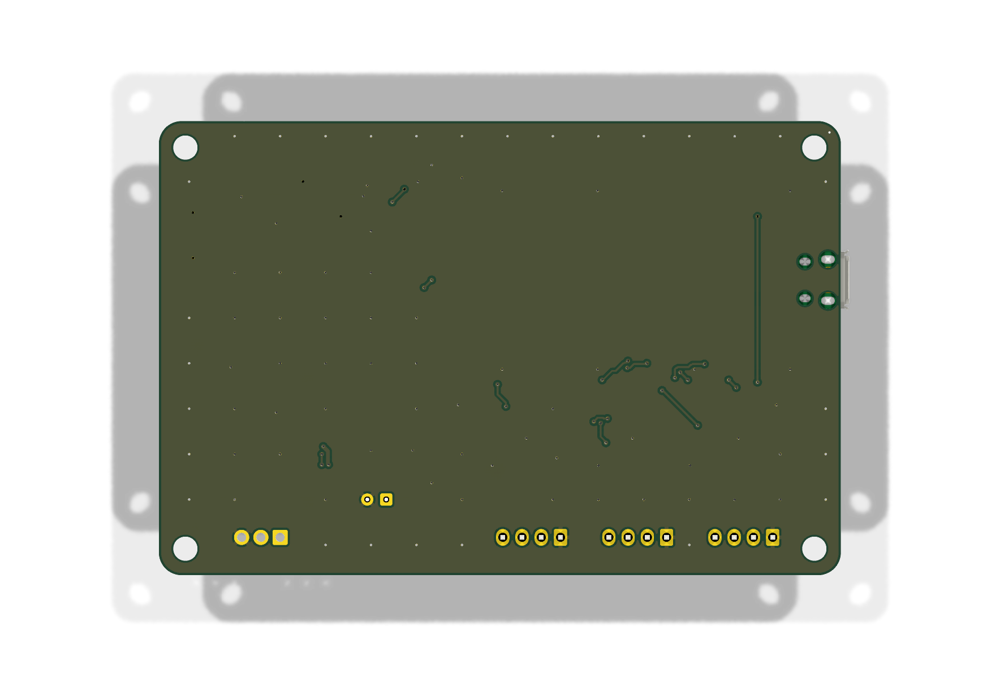

# Building FanCtrl3 Pro

A custom two-layer PCB, 90 × 60 mm, designed for **hand soldering**: 0805/1206
passives with hand-solder pads, SOT-23 packages, an SMA diode, no QFN and no parts
with pads underneath.

> [!NOTE]
> The PCB has not been manufactured or tested yet — hardware testing is coming
> soon. The design passes KiCad ERC (0), DRC (0 violations, 0 unconnected pads)
> and the schematic-parity check. If you want the safest path, build the
> [Lite variant](build-lite.md) first: it is the same circuit.

| Top | Bottom |
|---|---|
|  |  |

## Files

| File | What it is |
|---|---|
| [`fabrication/FanCtrl3-Pro-gerbers.zip`](../hardware/pro/fabrication/FanCtrl3-Pro-gerbers.zip) | Gerbers (copper, mask, paste, silkscreen, outline) + Excellon drill files, ready to upload to a PCB fab |
| [`fabrication/FanCtrl3-Pro-BOM.csv`](../hardware/pro/fabrication/FanCtrl3-Pro-BOM.csv) | bill of materials from KiCad, grouped by footprint, with TME order codes |
| [`FanCtrl3-Pro-schematic.pdf`](../hardware/pro/FanCtrl3-Pro-schematic.pdf) | schematic |
| [`FanCtrl3-Pro.kicad_pro`](../hardware/pro/FanCtrl3-Pro.kicad_pro) | the KiCad 10 project (schematic + PCB) |
| [`FanCtrl3-Pro-erc.rpt`](../hardware/pro/FanCtrl3-Pro-erc.rpt), [`FanCtrl3-Pro-drc.rpt`](../hardware/pro/FanCtrl3-Pro-drc.rpt) | the ERC and DRC reports |

## Ordering the PCB

Upload the Gerber ZIP to any PCB fab. The board uses only standard capabilities:

| | |
|---|---|
| Layers | 2 |
| Size | 90.1 × 60.1 mm |
| Thickness | 1.6 mm |
| Smallest track | 0.25 mm |
| Smallest clearance | 0.2 mm (0.3 mm to copper pours) |
| Vias | 0.3 mm drill, 0.6 mm pad |
| Smallest hole | 0.3 mm |
| Assembly | none — the board is meant to be soldered by hand |

Anything the fab's default options offer (FR-4, HASL, any colour) will do.

## Soldering order

Low parts first, tall parts last:

1. **U2 TPS2553** (SOT-23-6) and **U3 LM27313** (SOT-23-5) — check pin 1 against
   the silkscreen dot; the two chips are the only parts where orientation is easy
   to get wrong. Buying two of each is worth it.
2. **0805 resistors and capacitors**, then the **1206** capacitors C2, C4, C5.
3. **Q1–Q3 2N7002** (SOT-23).
4. **D1 SS14** — the band marks the cathode (towards the 12 V side).
5. **L1** inductor.
6. **The Pico**, flat on the board by its castellated edge. Align it so its micro-USB
   socket overhangs the board edge; tack two opposite corners, check, then solder
   the rest.
7. **C6** 100 µF (polarised), the three **fan headers**, the **probe terminal**.

## Before first power-up

> [!IMPORTANT]
> Before connecting USB, check with a multimeter:
> 1. no short between **VBUS** and **GND**;
> 2. no short between **12 V** and **GND** (on C6);
> 3. no short between the limited **5 V** (the TPS2553 output) and **GND**.
>
> First power-up without fans: the 12 V rail should read **about 12.4 V**. Then
> connect the fans — all three start at **100 %** until the firmware takes over.

Next: [flash the firmware](firmware.md), then [install the host side](host-proxmox.md).

## Regenerating the board

The schematic and the PCB are generated from
[`hardware/tools/design_pro.py`](../hardware/tools/design_pro.py) — do not edit
the `.kicad_sch` or `.kicad_pcb` by hand, the next build overwrites them.

```bash
hardware/tools/build_pro.sh    # schematic -> ERC -> placement -> routing -> DRC
hardware/tools/export_pro.sh   # Gerbers, drill, ZIP, BOM, schematic PDF
```

> [!WARNING]
> The router does not produce the same tracks on every run (every run passes DRC).
> **Always run `export_pro.sh` right after `build_pro.sh`**, otherwise the Gerbers
> no longer match the board file.

See [development.md](development.md).
